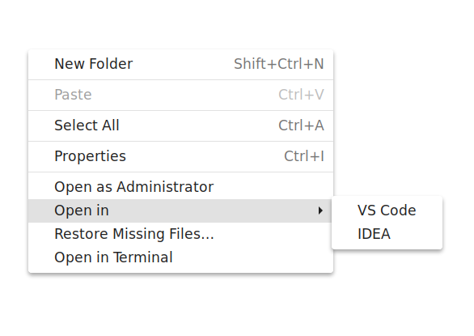

# Nautilus_OpenIn
This script add a 'Open in menu' in nautilus context menu. You can open Vs code, Idea.

The origin script from [cra0zy/VSCodeExtension.py](https://gist.github.com/cra0zy/f8ec780e16201f81ccd5234856546414)

### install

Before install this script make sure:
+ `python-nautilus` is installed.
+  You can use `code` and `idea` command to open Pycharm and Idea
 

Place `openInExtension.py` in ~/.local/share/nautilus-python/extensions/ 

Then exit Nautilus with command `nautilus -q`

